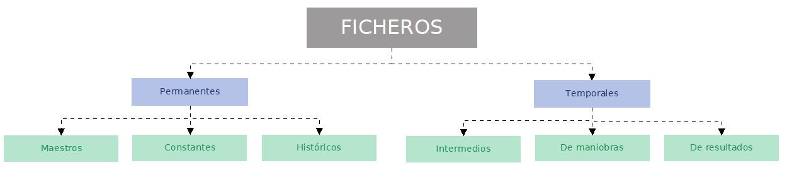
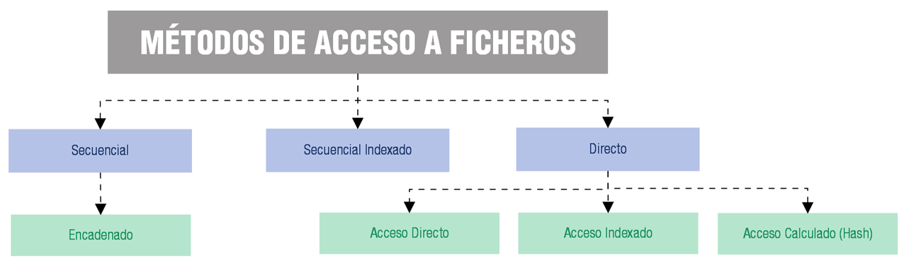
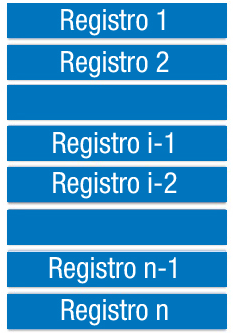
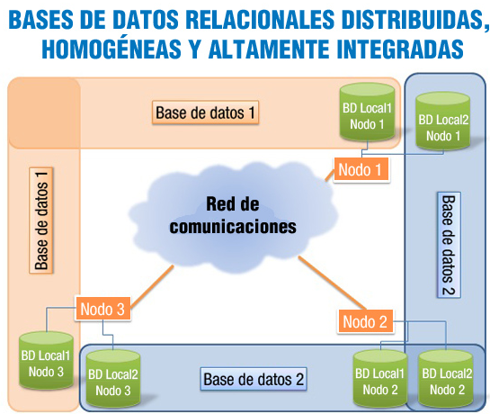

# ALMACENAMIENTO DE LA INFORMACIÓN

## **1. Los ficheros de información**
### **1.1. ¿Qué es un fichero?**
**Fichero o archivo:** conjunto de información relacionada, tratada como un todo y organizada de forma estructurada. Es una secuencia de dígitos binarios que organiza información relacionada con un mismo aspecto.

Los ficheros están formados por **registros lógicos** que contienen datos relativos a un mismo elemento u objeto. A su vez, los registros están divididos en campos que contienen cada una de las informaciones elementales que forman un registro (por ejemplo, el nombre del usuario o su dirección de correo electrónico).

Los datos están almacenados de tal forma que se puedan añadir, suprimir, actualizar o consultar individualmente en cualquier momento.

Como los ficheros suelen ser muy voluminosos, solo se pueden llevar a la memoria principal partes de ellos para poder procesarlos. La cantidad de información que es transferida entre el soporte en el que se almacena el fichero, y la memoria principal del ordenador, en una sola operación de lectura/grabación, recibe el nombre de **registro físico*** o **bloque**.

Normalmente en cada operación de lectura/grabación se transfieren varios registros del fichero, es decir un bloque suele contener varios registros lógicos. Al número de registros que entran en un bloque se le conoce con el nombre de **factor de blocaje**, y a esta operación de agrupar varios registros en un bloque se le llama **bloqueo de registros**.
### **1. 2. Tipos de ficheros**

Según la función que vaya a desempeñar los ficheros, éstos pueden ser clasificados de varias maneras. En la imagen puedes observar una posible clasificación.

1. **Ficheros permanentes:** contienen información relevante para una aplicación. Es decir, los datos necesarios para el funcionamiento de ésta. Tienen un periodo de permanencia en el sistema amplio. Estos se subdividen en: 
   1. **Ficheros maestros:** contienen el estado actual de los datos que pueden modificarse desde la aplicación. Es la parte central de la aplicación, su núcleo. Podría ser un archivo con los datos de los usuarios de una plataforma educativa.
   1. **Ficheros constantes:** son aquellos que incluyen datos fijos para la aplicación. No suelen ser modificados y se accede a ellos para realización de consultas. Podría ser un archivo con códigos postales.
   1. **Ficheros históricos:** contienen datos que fueron considerados como actuales en un periodo o situación anterior. Se utilizan para la reconstrucción de situaciones. Podría ser un archivo con los usuarios que han sido dados de baja en la plataforma educativa.
1. **Ficheros temporales:** Se utilizan para almacenar información útil para una parte de la aplicación, no para toda ella. Son generados a partir de datos de ficheros permanentes. Tienen un corto periodo de existencia. Estos se subdividen en: 
   1. **Ficheros intermedios:** almacenan resultados de una aplicación que serán utilizados por otra.
   1. **Ficheros de maniobras:** almacenan datos de una aplicación que no pueden ser mantenidos en memoria principal por falta de espacio.
   1. **Ficheros de resultados:** almacenan datos que van a ser transferidos a un dispositivo de salida.
### **1. 3. Los soportes de información**
Los ficheros se almacenan en soportes de información manejados por dispositivos periféricos del ordenador, que permiten leer y grabar datos en el soporte. Los soportes más utilizados para almacenar los ficheros son las cintas magnéticas y los discos (magnéticos, ópticos, o magneto-ópticos). Dentro de estos dos tipos de soporte existen en el mercado una gran variedad de modelos.

Por tanto, se distinguen dos tipos de soportes para el almacenamiento de datos:

- **Soportes de Acceso Directo a los datos** (Por ejemplo: discos). Son los más empleados y el acceso a los datos puede hacerse de forma directa,* pudiendo colocarnos en la posición que nos interesa y leer a partir de ella.
- **Soportes de Acceso Secuencial** (Por ejemplo: cintas magnéticas). Se suelen usar en copias de seguridad y si deseamos leer un dato que está en la mitad de la cinta, tendremos que leer todo lo que hay hasta llegar a esa posición.
### **1. 4 Métodos de acceso**
Los objetivos fundamentales de estas modificaciones pueden resumirse en:

- Proporcionar un acceso rápido a los registros.
- Conseguir economizar el almacenamiento.
- Facilitar la actualización de los registros.
- Permitir que la estructura refleje la organización real de la información.

Las distintas formas de organizar un fichero en un soporte de memoria o, lo que se conoce también por métodos de acceso a los ficheros se detallan en el siguiente gráfico.

Las organizaciones secuenciales, de acceso aleatorio o directo y de acceso indexado son las más comunes.
### **1.5. Ficheros secuenciales**
Un fichero con organización secuencial se caracteriza porque sus registros están almacenados de forma contigua, de manera, que la única forma de acceder a él, es leyendo un registro tras otro desde el principio hasta el final. En los ficheros secuenciales suele haber una marca indicativa del fin del fichero, que suele denominarse **EOF** (End of File). Para detectar el final del fichero sólo es necesario encontrar la marca EOF.

Este tipo de ficheros pueden utilizar dispositivos o soportes no direccionables o de acceso secuencial, como son las cintas magnéticas de almacenamiento de datos. También se utiliza en los CD de audio y los DVD de vídeo, en los que la música o las imágenes se almacenan a lo largo de una espiral continua.

Los registros almacenados se identifican por medio de una información ubicada en uno de sus campos, a este campo se le denomina **clave o llave**. Si se ordena un archivo secuencial por su clave, es más rápido realizar cualquier operación de lectura o escritura.

Otras características relevantes de los ficheros secuenciales son:

- La lectura siempre se realiza hacia delante.
- Son ficheros monousuarios, no permiten el acceso simultáneo de varios usuarios.
- Tienen una estructura rígida de campos. Todos los registros deben aparecer en orden, es decir, la posición de los campos de cada registro siempre ha de ser la misma.
- El modo de apertura del fichero, condiciona la lectura o escritura.
- Aprovechan al máximo el soporte de almacenamiento, al no dejar huecos vacíos.
- Se pueden grabar en cualquier tipo de soporte, tanto en secuenciales como direccionables.
- Todos los lenguajes de programación disponen de instrucciones para trabajar con este tipo de ficheros.
- No se pueden insertar registros entre los que ya están grabados.

  

### **1.6. Ficheros de acceso directo**
En este tipo de ficheros se puede acceder a un registro indicando la posición relativa del mismo dentro del archivo o, más comúnmente, a través de una clave que forma parte del registro como un campo más. Estos archivos deben almacenarse en dispositivos de memoria masiva de acceso directo, como son los discos magnéticos.

**Campo clave:** campo que permite identificar y localizar un registro de manera ágil y organizada.

Cada uno de los registros se guarda en una posición física, que dependerá del espacio disponible en memoria masiva, de ahí que la distribución de los registros sea aleatoria dentro del soporte de almacenamiento. Para acceder a la posición física de un registro se utiliza una dirección o índice, no siendo necesario recorrer todo el fichero para encontrar un determinado registro.

A través de una transformación específica aplicada a la clave, se obtendrá la dirección física en la que se encuentra el registro. Según la forma de realizar esta transformación, existen diferentes modos de acceso:

En el acceso directo la clave coincide con la dirección, debiendo ser numérica y comprendida dentro del rango de valores de las direcciones. Es el método más rápido.

La medida básica de posicionamiento del puntero en el fichero es el byte, dependiendo del tipo de codificación de caracteres que empleemos (Unicode, ANSI) se utilizarán 1 o 2 bytes por carácter respectivamente. Teniendo esto en cuenta, el puntero avanzará de uno en uno o de dos en dos bytes para poder leer o escribir cada carácter.

Otras características fundamentales de los ficheros de acceso directo o aleatorio son:

- Posicionamiento inmediato.
- Registros de longitud fija.
- Apertura del fichero en modo mixto, para lectura y escritura.
- Permiten múltiples usuarios utilizándolos.
- Los registros se borran colocando un cero en la posición que ocupan.
- Permiten la utilización de algoritmos de compactación de huecos.
- Los archivos se crean con un tamaño definido, es decir, con un máximo de registros establecido durante la creación.
- Esta organización sólo es posible en soportes direccionables.
- Se usan cuando el acceso a los datos de un registro se hace siempre empleando la misma clave y la velocidad de acceso a un registro es lo que más nos importa.
- Permiten la actualización de los registros en el mismo fichero, sin necesidad de copiar el fichero.
- Permiten realizar procesos de actualización en tiempo real.
### **1.7. Ficheros indexados**
Se basan en la utilización de **índices***,* que permiten el acceso a un registro del fichero de forma directa, sin tener que leer los anteriores. Estos índices son similares a los de los libros. Si nos interesa leer un capítulo concreto podemos recurrir al índice que nos dice en que página comienza, y abrimos el libro por esa página, sin tener que mirar en todas las páginas anteriores para localizarlo.

Por tanto, existirá una **zona de registros** en la que se encuentran los datos del archivo y una **zona de índices,** que contiene una tabla con las claves de los registros y las posiciones donde se encuentran los mismos. La tabla de índices estará ordenada por el campo clave.

La tabla de índices será cargada en memoria principal para realizar en ella la búsqueda de la fila correspondiente a la clave del registro a encontrar, obteniéndose así la dirección donde se encuentra el registro. Una vez localizada la dirección, sólo hay que acceder a la zona de registros en el soporte de almacenamiento y posicionarnos en la dirección indicada. Puesto que la tabla debe prever la inclusión de todas las direcciones posibles del archivo, su principal inconveniente resulta determinar su tamaño y mantenerla ordenada por los valores de la clave.

Las características más relevantes de un fichero indexado, son las siguientes:

- El diseño del registro tiene que tener un campo, o combinación de campos, que permita identificar cada registro de forma única, es decir, que no pueda haber dos registros que tengan la misma información en él. A este campo se le llama **campo clave*** y es el que va a servir de índice. Un mismo fichero puede tener más de un campo clave, pero al menos uno de ellos no admitirá valores duplicados y se le llama clave primaria. A las restantes se les llama claves alternativas.
- Permiten utilizar el modo de **acceso secuencial** y el modo de **acceso directo*** para leer la información guardada en sus registros.
- Para acceder a este tipo de ficheros utilizando el modo de acceso directo se hace conociendo el contenido del campo clave del registro que queremos localizar. Con esa información el sistema operativo puede consultar el índice y conocer la posición del registro dentro del fichero.
- Para acceder a este tipo de ficheros utilizando el modo de acceso secuencial los registros son leídos ordenados por el contenido del campo clave, independientemente del orden en que se fueron grabando (el orden lógico no es igual al orden físico), debido a que el acceso a los datos se hace a través del índice, que para hacer más fácil la búsqueda de los registros, permanece siempre ordenado por el campo clave.
- Solamente se puede grabar en un soporte direccionable. Por ejemplo, un disco magnético. Si esto no fuera así, no podría emplear el acceso directo.
### **1.8. Otros (secuenciales indexados, hash.)**
**Ficheros Secuenciales Indexados**

También llamados parcialmente indexados, al igual que en los ficheros indexados existe una **zona de índices** y otra **zona de registros de datos**, pero esta última se encuentra dividida en **segmentos** (bloques de registros) ordenados.

En la tabla de índices, cada fila hace referencia a cada uno de los segmentos. La clave corresponde al último registro y el índice apunta al registro inicial. Una vez que se accede al primer registro del segmento, dentro de él se localiza (de forma secuencial) el registro buscado.

Esta organización es muy utilizada, tanto para procesos en los que intervienen pocos registros como para aquellos en los que se maneja el fichero completo.

Las principales características son:

- Permite el acceso secuencial. Esto es muy interesante cuando la tasa de actividad es alta. En el acceso secuencial, además, los registros se leen ordenados por el campo clave.
- Permite el acceso directo a los registros. Realmente emula el acceso directo, empleando para ello las tablas de índices. Primero busca la clave en el área de índices y luego va a leer al área de datos en la dirección que le indica la tabla.
- Se pueden actualizar los registros en el mismo fichero, sin necesidad de crear un fichero nuevo de copia en el proceso de actualización.
- Ocupa más espacio en el disco que los ficheros secuenciales, debido al uso del área de índices.
- Solo se puede utilizar soportes direccionables.
- Obliga a una inversión económica mayor, por la necesidad de programas y, a veces, hardware más sofisticado.

**Ficheros de Acceso Calculado o Hash**

Cuando utilizamos ficheros indexados es necesario siempre tener que consultar una tabla para obtener la dirección de almacenamiento a partir de la clave. La técnica del acceso calculado o **hash**, permite accesos más rápidos, ya que en lugar de consultar una tabla, se utiliza una transformación o función matemática (función de hashing) conocida, que a partir de la clave genera la dirección de cada registro del archivo. Si la clave es alfanumérica, deberá previamente ser transformada en un número.

El mayor problema que presenta este tipo de ficheros es que a partir de diferentes claves se obtenga la misma dirección al aplicar la función matemática o transformación. A este problema se le denomina **colisión**, y las claves que generan la misma dirección se conocen por **sinónimos**. Para resolver este problema se aplican diferentes métodos, como tener un bloque de excedentes o zona de sinónimos, o crear un archivo de sinónimos, etc.

Para llevar a cabo la transformación existen multitud de métodos, siendo algunos:

- **Módulo:** La dirección será igual al resto de la división entera entre la clave y el número de registros.
- **Extracción:** La dirección será igual a una parte de las cifras que se extraen de la clave.

Una buena transformación o función de hash, será aquella que produzca el menor número de colisiones. En este caso hay que buscar una función, a ser posible biunívoca (correspondencia 1 a 1), que relacione los posibles valores de la clave con el conjunto de números correlativos de dirección. Esta función consistirá en realizar una serie de cálculos matemáticos con el valor de la clave hasta obtener un número entre 1 y n, siendo n el número de direcciones que tiene el fichero.
### **1.9. Parámetros de utilización**
En función del uso que se vaya a dar al fichero, serán adecuados unos tipos u otros de organización. Mediante la utilización de **parámetros de referencia**, podremos determinar el uso de un fichero. Estos parámetros son: 

1. **Capacidad o volumen:** es el espacio, en caracteres, que ocupa el fichero. La capacidad podrá calcularse multiplicando el número previsto de registros por la longitud media de cada registro.
1. **Actividad:** permite conocer la cantidad de consultas y modificaciones que se realizan en el fichero. Para poder especificar la actividad se deben tener en cuenta: 
   1. **Tasa de consulta o modificación:** que es el porcentaje de registros consultados o modificados en cada tratamiento del fichero, respecto al número total de registros contenidos en él.
   1. **Frecuencia de consulta o modificación:** número de veces que se accede al fichero para hacer una consulta o modificación en un periodo de tiempo fijo.
1. **Volatilidad:** mide la cantidad de inserciones y borrados que se efectúan en un fichero. Para determinar la volatilidad es necesario conocer: 
   1. **Tasa de renovación:** es el tanto por ciento de registros renovados en cada tratamiento del fichero, respecto al número total de registros contenidos en él.
   1. **Frecuencia de renovación:** es el número de veces que se accede al fichero para renovarlo en un periodo de tiempo fijo.
1. **Crecimiento:** es la variación de la capacidad del fichero y se mide con la tasa de crecimiento, que es el porcentaje de registros en que aumenta el fichero en cada tratamiento.
## **2 Bases de datos**
### **2.1. Conceptos**
**Base de datos:** Es una colección de datos relacionados lógicamente entre sí, con una definición y descripción comunes y que están estructurados de una determinada manera. Es un conjunto estructurado de datos que representa entidades y sus interrelaciones, almacenados con la mínima redundancia y posibilitando el acceso a ellos eficientemente por parte de varias aplicaciones y usuarios.

La base de datos no sólo contiene los datos de la organización, también almacena una descripción de dichos datos. Esta descripción es lo que se denomina **metadatos**, se almacena en el **diccionario de datos o catálogo*** y es lo que permite que exista **independencia de datos** lógica-física.

Una base de datos constará de los siguientes elementos:

- **Entidades:** objeto real o abstracto con características diferenciadoras de otros, del que se almacena información en la base de datos. Dicho de otra forma, es algo acerca de lo cual se desea almacenar información. En una base de datos de una clínica veterinaria, posibles entidades podrían ser: ejemplar, doctor, consulta, etc.
- **Atributos:** son los datos que se almacenan de la entidad. Cualquier propiedad o característica de una entidad puede ser atributo. Continuando con nuestro ejemplo, podrían ser atributos: raza, color, nombre, número de identificación, etc.
- **Registros:** donde se almacena la información de cada entidad. Es un conjunto de atributos que contienen los datos que pertenecen a una misma repetición de entidad. En nuestro ejemplo, un registro podría ser: 2123056, Sultán, Podenco, Gris, 23/03/2009.
- **Campos:** donde se almacenan los atributos de cada registro. Teniendo en cuenta el ejemplo anterior, un campo podría ser el valor Podenco.

Las **ventajas fundamentales** que ofrece el uso de bases de datos se resumen a continuación:

- **Acceso múltiple**: diversos usuarios o aplicaciones podrán acceder a la base de datos, sin que existan problemas en el acceso o los datos.
- **Utilización múltiple**: cada uno de los usuarios o aplicaciones podrán disponer de una visión particular de la estructura de la base de datos, de tal manera que cada uno de ellos accederá sólo a la parte que realmente le corresponde.
- **Flexibilidad**: la forma de acceder a la información puede ser establecida de diferentes maneras, ofreciendo tiempos de respuesta muy reducidos.
- **Confidencialidad y seguridad**: el control del acceso a los datos podrá ser establecido para que unos usuarios o aplicaciones puedan acceder a unos datos y a otros no, impidiendo a los usuarios no autorizados la utilización de la base de datos.
- **Protección contra fallos**: en caso de errores en la información, existen mecanismos bien definidos que permiten la recuperación de los datos de forma fiable.
- **Independencia física**: un cambio de soporte físico de los datos (por ejemplo: el tipo de discos), no afectaría a la base de datos o a las aplicaciones que acceden a ellos.
- **Independencia lógica**: los cambios realizados en la base de datos no afectan a las aplicaciones que la usan.
- **Redundancia**: los datos se almacenan, por lo general, una única vez. Aunque si es necesario, podríamos repetir información de manera controlada.
- **Interfaz de alto nivel**: mediante la utilización de lenguajes de alto nivel puede utilizarse la base de datos de manera sencilla y cómoda.
- **Consulta directa**: existe una herramienta para poder acceder a los datos interactivamente.
### **2.2 Usos**
Existen cuatro tipos de personas que pueden hacer uso de una base de datos: el administrador, los diseñadores de la base de datos, los programadores de aplicaciones y los usuarios finales.

**El administrador**

Es la persona encargada de la creación o implementación física de la base de datos. Es quien escoge los tipos de ficheros, los índices que hay que crear, la ubicación de éstos, etc. En general, es quien toma las decisiones relacionadas con el funcionamiento físico del almacenamiento de información. Siempre teniendo en cuenta las posibilidades del sistema de información con el que trabaje. Junto a estas tareas, el administrador establecerá la política de seguridad y de acceso para garantizar el menor número de problemas.

**Los diseñadores**

Son las personas encargadas de diseñar cómo será la base de datos. Llevarán a cabo la identificación de los datos, las relaciones entre ellos, sus restricciones, etc. Para ello han de conocer a fondo los datos y procesos a representar en la base de datos. Si estamos hablando de una empresa, será necesario que conozcan las reglas de negocio en la que esta se mueve. Para obtener un buen resultado, el diseñador de la base de datos debe implicar en el proceso a todos los usuarios de la base de datos, tan pronto como sea posible.

**Los programadores de aplicaciones**

Una vez diseñada y construida la base de datos, los programadores se encargarán de implementar los programas de aplicación que servirán a los usuarios finales. Estos programas de aplicación ofrecerán la posibilidad de realizar consultas de datos, inserción, actualización o eliminación de los mismos. Para desarrollar estos programas se utilizan lenguajes de tercera o cuarta generación.

**Los usuarios finales**

Son los clientes finales de la base de datos. Al diseñar, implementar y mantener la base de datos se busca cumplir los requisitos establecidos por el cliente para la gestión de su información.
### **2.3. Ubicación de la información**
Utilizamos a diario las bases de datos, pero ¿dónde se encuentra realmente almacenada la información? Las bases de datos pueden tener un tamaño muy reducido (1 MegaByte o menos) o bien, ser muy voluminosas y complejas (del orden de Terabytes). Sin embargo, todas las bases de datos normalmente se almacenan y localizan en discos duros y otros dispositivos de almacenamiento, a los que se accede a través de un ordenador. Una gran base de datos puede necesitar servidores en lugares diferentes, y viceversa, pequeñas bases de datos pueden existir como archivos en el disco duro de un único equipo.

A continuación, se exponen los sistemas de almacenamiento de información más utilizados para el despliegue de bases de datos, comenzaremos por aquellos en los que pueden alojarse bases de datos de tamaño pequeño y mediano, para después analizar los sistemas de alta disponibilidad de grandes servidores.

- **Discos SATA:** Es una interfaz de transferencia de datos entre la placa base y algunos dispositivos de almacenamiento, como puede ser el disco duro, lectores y regrabadores de CD/DVD/BD, Unidades de Estado Sólido u otros dispositivos. SATA proporciona mayores velocidades, mejor aprovechamiento cuando hay varias unidades, mayor longitud del cable de transmisión de datos y capacidad para conectar unidades al instante, es decir, insertar el dispositivo sin tener que apagar el ordenador. La primera generación especifica en transferencias de 150 Megabytes por segundo, también conocida por SATA 150 MB/s o Serial ATA-150. Actualmente se comercializan dispositivos SATA II, a 300 MB/s, también conocida como Serial ATA-300 y los SATA III con tasas de transferencias de hasta 600 MB/s.
- **Discos SCSI:** Son interfaces preparadas para discos duros de gran capacidad de almacenamiento y velocidad de rotación. Se presentan bajo tres especificaciones: SCSI Estándar (Standard SCSI), SCSI Rápido (Fast SCSI) y SCSI Ancho-Rápido (Fast-Wide SCSI). Su tiempo medio de acceso puede llegar a 7 milisegundos y su velocidad de transmisión secuencial de información puede alcanzar teóricamente los 5 MB/s en los discos SCSI Estándares, los 10 MBps en los discos SCSI Rápidos y los 20 MBps en los discos SCSI Anchos-Rápidos (SCSI-2). Un controlador SCSI puede manejar hasta 7 discos duros SCSI.
- **RAID:** acrónimo de Redundant Array of Independent Disks o matriz de discos independientes, es un contenedor de almacenamiento redundante. Se basa en el montaje en conjunto de dos o más discos duros, formando un bloque de trabajo, para obtener desde una ampliación de capacidad a mejoras en velocidad y seguridad de almacenamiento. Según las características que queramos primar, se establecen distintos sistemas de RAID.
- **Sistemas NAS:** Es el acrónimo de Network Attached Storage ó sistema de almacenamiento masivo en red. Estos sistemas de almacenamiento permiten compartir la capacidad de almacenamiento de un computador (Servidor) con ordenadores personales o servidores clientes a través de una red, haciendo uso de un sistema operativo optimizado para dar acceso a los datos a través de protocolos de comunicación específicos. Suelen ser dispositivos para almacenamiento masivo de datos con capacidades muy altas, de varios Terabytes, generalmente superiores a los discos duros externos y además se diferencian de estos al conectar por red.
- **Sistemas SAN:** Acrónimo de Storage Area Network o red de área de almacenamiento. Se trata de una red concebida para conectar servidores, matrices (arrays) de discos y librerías de soporte. La arquitectura de este tipo de sistemas permite que los recursos de almacenamiento estén disponibles para varios servidores en una red de área local o amplia. Debido a que la información almacenada no reside directamente en ninguno de los servidores de la red, se optimiza el poder de procesamiento para aplicaciones comerciales y la capacidad de almacenamiento se puede proporcionar en el servidor donde más se necesite.
## **3. Modelos de bases de datos**
La clasificación tradicional de las bases de datos establece tres modelos de bases de datos: **jerárquico, en red y relacional**. En la actualidad el modelo de bases de datos más extendido es el relacional. Aunque, hay que tener en cuenta que dos de sus variantes (modelo de bases de datos distribuidas y orientadas a objetos) son las que se más se están utilizando en los últimos tiempos.
### **3.1. Modelo jerárquico**
Cuando IBM creó su Sistema Administrador de Información o IMS, se establecieron las bases para que la gran mayoría de sistemas de gestión de información de los años setenta utilizaran el modelo jerárquico. También recibe el nombre de modelo en árbol, ya que utiliza una estructura en árbol invertido para la organización de los datos.

La información se organiza con una jerarquía en la que la relación entre las entidades de este modelo siempre es del tipo padre/hijo. De tal manera que existen nodos que contienen atributos o campos y que se relacionarán con sus nodos hijos, pudiendo tener cada nodo más de un hijo, pero un nodo siempre tendrá un sólo padre.

Los datos de este modelo se almacenan en estructuras lógicas llamadas segmentos. Los segmentos se relacionan entre sí utilizando arcos. La forma visual de este modelo es de árbol invertido, en la parte superior están los padres y en la inferior los hijos.

Hoy en día, debido a sus limitaciones, el modelo jerárquico está en desuso. En el siguiente gráfico puedes observar la estructura de almacenamiento del modelo jerárquico.

### **3.2. Modelo en red**
El modelo de datos en red aparece a mediados de los sesenta como respuesta a limitaciones del modelo jerárquico en cuanto a representación de relaciones más complejas. Podemos considerar a IDS (Integrated Data Store) de Bachman como el primer sistema de base de datos en red. Tras él se intentó crear un estándar de modelo de red por parte de CODASYL, siendo un modelo que tuvo gran aceptación a principios de los setenta.

El modelo en red organiza la información en registros (también llamados nodos) y enlaces. En los registros se almacenan los datos, mientras que los enlaces permiten relacionar estos datos. Las bases de datos en red son parecidas a las jerárquicas sólo que en ellas puede haber más de un padre.

En este modelo se pueden representar perfectamente cualquier tipo de relación entre los datos, pero hace muy complicado su manejo. Al no tener que duplicar la información se ahorra espacio de almacenamiento.

El sistema de gestión de información basado en el modelo en red más popular es el sistema IDMS.

### **3.3. Modelo relacional**
Este modelo es posterior a los dos anteriores y fue desarrollado por Codd en 1970. Hoy en día las bases de datos relacionales son las más utilizadas.

En el modelo relacional la base de datos es percibida por el usuario como un conjunto de tablas. Esta percepción es sólo a nivel lógico, ya que a nivel físico puede estar implementada mediante distintas estructuras de almacenamiento.

El modelo relacional utiliza **tablas bidimensionales** (relaciones) para la representación lógica de los datos y las relaciones entre ellos. Cada relación (tabla) posee un nombre que es único y contiene un conjunto de columnas.

Se llamará **registro, entidad o tupla** a cada fila de la tabla y **campo o atributo** a cada columna de la tabla.

A los conjuntos de valores que puede tomar un determinado atributo, se le denomina **dominio**.

Una **clave** será un atributo o conjunto de atributos que identifique de forma única a una tupla.

Las tablas deben cumplir una serie de requisitos:

- Todos los registros son del mismo tipo.
- La tabla sólo puede tener un tipo de registro.
- No existen campos o atributos repetidos.
- No existen registros duplicados.
- No existe orden en el almacenamiento de los registros.
- Cada registro o tupla es identificada por una clave que puede estar formada por uno o varios campos o atributos.

El lenguaje habitual para construir las consultas a bases de datos relacionales es SQL, Structured Query Language o Lenguaje Estructurado de Consultas, un estándar implementado por los principales motores o sistemas de gestión de bases de datos relacionales.

Durante su diseño, una base de datos relacional pasa por un proceso al que se conoce como normalización de una base de datos. La normalización de bases de datos relacional consiste en definir las reglas que determinan las dependencias entre los datos de una base de datos relacional. Si definimos esta relación o dependencia entre los elementos de una determinada base de datos de la manera más sencilla posible, conseguiremos que la cantidad de espacio necesario para guardar los datos sea el menor posible y la facilidad para actualizar la relación sea la mayor posible asegurando la coherencia de la información. Es decir, optimizaremos su funcionamiento.
### **3.4. Modelo orientado a objetos**
El modelo orientado a objetos define una base de datos en términos de **objetos**, sus propiedades y sus operaciones. Los objetos con la misma estructura y comportamiento pertenecen a una **clase**, y las clases se organizan en jerarquías. Las operaciones de cada clase se especifican en términos de procedimientos predefinidos denominados **métodos**. Algunos sistemas existentes en el mercado, basados en el modelo relacional, han sufrido evoluciones incorporando conceptos orientados a objetos. A estos modelos se les conoce como sistemas **objeto-relacionales**.

El objetivo del modelo orientado a objetos es cubrir las limitaciones del modelo relacional. Gracias a este modelo se incorporan mejoras como la herencia entre tablas, los tipos definidos por el usuario, soporte multimedia, etc.

Los conceptos más importantes del paradigma de objetos que el modelo orientado a objetos incorpora son:

- **Encapsulación** - Propiedad que permite ocultar la información al resto de los objetos, impidiendo así accesos incorrectos o conflictos.
- **Herencia** - Propiedad a través de la cual los objetos heredan comportamiento dentro de una jerarquía de clases.
- **Polimorfismo** - Propiedad de una operación mediante la cual puede ser aplicada a distintos tipos de objetos.

Desde la aparición de la programación orientada a objetos (POO u OOP) se empezó a pensar en bases de datos adaptadas a estos lenguajes. Este modelo es considerado como el fundamento de las bases de datos de tercera generación, siendo consideradas las bases de datos en red como la primera y las bases de datos relacionales como la segunda generación. Aunque no han reemplazado a las bases de datos relacionales, si son el tipo de base de datos que más está creciendo en los últimos años.
### **3.5. Otros modelos**
Además de los modelos clásicos vistos hasta el momento, vamos a detallar a continuación las particularidades de otros modelos de bases de datos existentes y que, en algunos casos, son una evolución de los clásicos.

**Modelo Objeto-Relacional** 

Las bases de datos pertenecientes a este modelo, son un híbrido entre las bases del modelo relacional y el orientado a objetos. El mayor inconveniente de las bases de datos orientadas a objetos radica en los costes de la conversión de las bases de datos relacionales a bases de datos orientadas a objetos.

En una base de datos objeto-relacional (BDOR) siempre se busca obtener lo mejor del modelo relacional, incorporando las mejoras ofrecidas por la orientación a objetos. En este modelo se siguen almacenando tuplas, aunque la estructura de las tuplas no está restringida, sino que las relaciones pueden ser definidas en función de otras, que es lo que denominamos herencia directa.

El estándar en el que se basa este modelo es [SQL99](https://www.mecd.es/cidead/aulavirtual/pluginfile.php/392683/mod_resource/content/3/BD01_Contenidos_Imprimible/index.html#t846d4b5d-6cd0-3162-7d2e-f16ce87abcbb). Este estándar ofrece la posibilidad de añadir a las bases de datos relacionales procedimientos almacenados de usuario, triggers, tipos definidos por el usuario, consultas recursivas, bases de datos [OLAP](https://www.mecd.es/cidead/aulavirtual/pluginfile.php/392683/mod_resource/content/3/BD01_Contenidos_Imprimible/index.html#t01f42944-9f69-4653-a163-0eaceb36a84b), tipos [LOB](https://www.mecd.es/cidead/aulavirtual/pluginfile.php/392683/mod_resource/content/3/BD01_Contenidos_Imprimible/index.html#t432afe15-6410-5ee8-cbcb-04ea743eceb0), ...

Otra característica a destacar es la capacidad para incorporar funciones que tengan un código en algún lenguaje de programación como, por ejemplo: SQL, Java, C, etc.

La gran mayoría de las bases de datos relacionales clásicas de gran tamaño, como Oracle, SQL Server, etc., son objeto-relacionales.

**Modelo de bases de datos deductivas** 

En este modelo las bases de datos almacenan la información y permiten realizar deducciones a través de [inferencias.](https://www.mecd.es/cidead/aulavirtual/pluginfile.php/392683/mod_resource/content/3/BD01_Contenidos_Imprimible/index.html#tbcb6a61b-7cbc-6ef8-78b4-46e4cbc6b8eb) Es decir, se derivan nuevas informaciones a partir de las que se han introducido explícitamente en la base de datos por parte del usuario.

Las bases de datos deductivas son también llamadas bases de datos lógicas, al basarse en lógica matemática. Surgieron para contrarrestar las limitaciones del modelo relacional para la respuesta a consultas [recursivas](https://www.mecd.es/cidead/aulavirtual/pluginfile.php/392683/mod_resource/content/3/BD01_Contenidos_Imprimible/index.html#t939feba5-bcd8-2f9f-aed6-5c20e457af0e) y la deducción de relaciones indirectas entre los datos almacenados.

**Bases de datos multidimensionales** 

Son bases de datos ideadas para desarrollar aplicaciones muy concretas. Básicamente almacena sus datos con varias dimensiones, es decir que, en vez de un valor, encontramos varios dependiendo de los ejes definidos o una base de datos de estructura basada en dimensiones orientada a consultas complejas y alto rendimiento. En una base de datos multidimensional, la información se representa como matrices multidimensionales, cuadros de múltiples entradas o funciones de varias variables sobre conjuntos finitos. Cada una de estas matrices se denomina cubo. Eso facilita el manejo de grandes cantidades de datos dentro de empresas, dándole a esto una amplia aplicación dentro de varias áreas y diferentes campos del conocimiento humano.

**Bases de datos transaccionales** 

Son bases de datos caracterizadas por su velocidad para gestionar el intercambio de información, se utilizan sobre todo en sistemas bancarios, análisis de calidad y datos de producción industrial. Son bases de datos muy fiables, ya que en ellas cada una de las operaciones de inserción, actualización o borrado se realizan completamente o se descartan. Entre la más destacadas se encuentra Oracle.

**Modelo de bases de datos orientadas a documentos.** En este modelo el principal objeto de gestión es el documento que contiene datos semiestructurados que podrán estar almacenados en algún formato, por ejemplo, XML. Como ejemplo de este tipo de bases de datos puedes encontrar [**MongoDB** ](https://www.mongodb.com/es "Accede a la página oficial de MongoDB (se abre en una ventana nueva)")y [**CouchDB**](http://couchdb.apache.org/ "Accede a la página oficial de CouchDB (se abre en una ventana nueva)").
## **4. Tipos**
### **Clasificación de las bases de datos**
**Bases de datos según su contenido**

- **Bases de datos con información actual**: contienen información muy concreta y actualizada, normalmente, de tipo numérico: estadísticas, series históricas, resultados de encuestas, convocatorias de becas o subvenciones, convocatorias de eventos, ofertas de empleo, ...
- **Directorios:** recogen datos sobre personas o instituciones especializadas en una actividad o materia concreta. Hay directorios de profesionales, de investigadores, de centros de investigación, de bibliotecas, de revistas científicas, de empresas, de editoriales, ...
- **Bases de datos documentales.** En este último grupo, cada registro se corresponde con un documento, sea éste de cualquier tipo: una publicación impresa, un documento audiovisual, gráfico. Dependiendo de si incluyen o no el contenido completo de los documentos que describen, podremos tener:
  - **Bases de datos de texto completo**: constituidas por los propios documentos en formato electrónico, por un volcado completo de su texto.
  - ` `**Archivos electrónicos de imágenes**: constituidos por referencias que permiten un enlace directo con la imagen del documento original, sea éste un documento iconográfico (fotografías, imágenes de televisión...) o un documento impreso digitalizado en formato de imagen.
  - ` `**Bases de datos referenciales:** sus registros no contienen el texto original sino tan sólo la información fundamental para describir y permitir la localización de documee obtener referencias sobre documentos que habrá que localizar posteriormente en otro servicio (archivo, biblioteca, fototeca, fonoteca...) o solicitar a un servicio de suministro de documentos.

**Bases de datos según su uso**

- **Base de datos individual:** Es una base de datos utilizada básicamente por una persona. El sistema administrador de la base de datos y los datos son controlados por el mismo usuario. Puede estar almacenada en la unidad de disco duro del usuario o en el servidor de archivos de una red de área local. Por ejemplo, un gerente de ventas podría contar con una base de datos para el control de sus vendedores y su desempeño. 
- **Base de datos compartida:** Son bases de datos con múltiples usuarios y que muy probablemente pertenezcan a la misma organización, como la base de datos de una compañía. Se encuentra almacenada en una computadora potente y bajo el cuidado de un profesional en el área, el administrador de la base de datos. Los usuarios tienen acceso a la base de datos mediante una red de área local o una red de área extensa. 
- **Base de datos de acceso público:** Son bases de datos accesibles por cualquier persona. Puede no ser necesario pagar un canon para hacer uso de los datos contenidos en ellas. 
- **Base de datos propietarias o bancos de datos:** Se trata en general de bases de datos de gran tamaño, desarrolladas por una organización y que contienen temas especializados o de carácter particular. El público general puede tener acceso a estas bases a veces de forma gratuita y otras mediante el pago de una cuota. Pueden ofrecer información que va desde negocios, economía, inversión, técnica y científica hasta servicios de entretenimiento. Permiten encontrar en minutos lo que tardaría horas ojeando revistas. 

**Bases de datos según la variabilidad de la información**

- **Bases de datos estáticas**: Son bases de datos de sólo lectura. Se utilizan para el almacenamiento de datos históricos que pueden ser analizados y utilizados para el estudio del comportamiento de un conjunto de datos a través del tiempo. Permiten realizar proyecciones y toma de decisiones.
- **Bases de datos dinámicas**: Son bases de datos donde la información almacenada se modifica con el tiempo, permitiendo operaciones como actualización y adición de datos, además de las operaciones fundamentales de consulta.

**Bases de datos según la localización de la información**

- **Bases de datos centralizadas**: Se trata de bases de datos ubicadas en un único lugar, un único computador. Pueden ser bases de datos monousuario que se ejecutan en ordenadores personales o sistemas de bases de datos de alto rendimiento que se ejecutan en grandes sistemas. Este tipo de organización facilita las labores de mantenimiento, sin embargo, hace que la información contenida en dicha base, sea más vulnerable a posibles fallos y limita su acceso. Este tipo de bases de datos puede ofrecer dentro de la arquitectura Cliente/Servidor dos configuraciones: 
  - **Basada en anfitrión**: ocurre cuando la máquina cliente y la máquina servidor son la misma. Los usuarios se conectarán directamente a la máquina donde se encuentra la base de datos.
  - **Basada en Cliente/Servidor**: ocurrirá cuando la base de datos reside en una máquina servidor y los usuarios acceden a la base de datos desde su máquina cliente a través de una red.
- **Bases de datos distribuidas**: Según la naturaleza de la organización es probable que los datos no se almacenen en un único punto, sino que se sitúen en un lugar o lugares diferentes a donde se encuentran los usuarios. Una base de datos distribuida es la unión de las bases de datos mediante redes. Los usuarios se vinculan a los servidores de bases de datos distantes mediante una amplia variedad de redes de comunicación. Puede imaginarse una compañía con diferentes oficinas regionales, donde se encuentra distribuida la base de datos. Sin embargo, los ejecutivos pueden tener acceso a la información de todas las oficinas regionales.

**Bases de datos según el organismo productor**

- **Bases de datos de organismos públicos y de la Administración**: Las bibliotecas y centros de documentación de los ministerios, instituciones públicas, universidades y organismos públicos de investigación elaboran gran cantidad de recursos de información. Estos sistemas pueden ser: 
  - **Bases de datos de acceso público**, sean gratuitas o no.
  - **Bases de datos de uso interno**, con información de acceso restringido.
- **Bases de datos de instituciones sin ánimo de lucro**: Fundaciones, asociaciones, Sindicatos y organizaciones no gubernamentales elaboran frecuentemente sus propios sistemas de información especializados.
- **Bases de datos de entidades privadas o comerciales**: Los centros de documentación, bibliotecas y archivos de las empresas pueden elaborar distintos tipos de sistemas de información: 
  - Bases de datos de uso interno para facilitar la circulación de información dentro de la empresa
  - Bases de datos de uso interno que ocasionalmente ofrecen servicio hacia el exterior (usuarios particulares u otras instituciones).
  - Bases de datos comerciales, diseñadas específicamente para ser utilizadas por usuarios externos.
- **Bases de datos realizadas por cooperación en red**: Se trata de sistemas de información cuya elaboración es compartida por diversas instituciones. bases de datos internacionales se elaboran a través de este sistema de trabajo, con diversos centros nacionales responsables de la información perteneciente a cada país.

**Bases de datos según el modo de acceso**

- **Bases de datos de acceso local**: Para consultarlas es necesario acudir al organismo productor, a su biblioteca o centro de documentación. Pueden ser consultables en monopuesto o en varios puntos de una red local.
- **Bases de datos en CD-ROM**: Pueden adquirirse por compra o suscripción bien directamente por un particular o por una biblioteca o centro de documentación que permita su consulta a sus usuarios. En algunas instituciones se instalan diferentes CD-ROM en una red local para permitir su consulta desde cualquier ordenador conectado a la misma.
- **Bases de datos en línea:** Pueden consultarse desde cualquier ordenador conectado a Internet. La consulta puede ser libre (gratuita) o exigir la solicitud previa de una clave personal de entrada (denominada comúnmente con el término inglés password). Para obtener un password puede exigirse la firma de un contrato. Hay diferentes tipos de acceso en línea: 
  - **Acceso vía telnet o mediante línea de Internet**: el usuario realiza una conexión estable al host (gran ordenador) en donde se halla la base de datos, a través de Internet. La interfaz de usuario instalada en dicho ordenador remoto determinará si la interrogación debe realizarse por menús o por comandos o expresiones de un lenguaje determinado. Cuando un usuario entra en una base de datos vía telnet establece una sesión de trabajo interactiva con el programa que gestiona la base de datos, que le permite aplicar todas las posibilidades de interrogación que tenga el sistema: selección, combinación y visualización o impresión de resultados. En cualquier momento podrá visualizar todas las búsquedas realizadas hasta ese instante y establecer combinaciones entre ellas.
  - **Acceso vía web**: conexión a través de un formulario existente en una página web de Internet, diseñado para lanzar preguntas a una base de datos.

Una misma base de datos puede tener acceso local y además una edición en CD-ROM y un sistema de acceso en línea. Sin embargo, puede haber diferencias en el contenido presente en cada uno de estos formatos o en el grado de actualización de la información. Por ejemplo, el productor de una base de datos puede ofrecer la conexión en línea a la base de datos completa con actualización diaria y, en cambio, editar un CD-ROM que tan sólo contenga los últimos cinco años de información y se actualice semestralmente.

**Bases de datos según cobertura temática**

- **Bases de datos científico-tecnológicas**: contienen información destinada a los investigadores de cualquier ámbito científico o técnico. A su vez, este grupo puede dividirse en: 
  - **Bases de datos multidisciplinares**: abarcan varias disciplinas científicas o técnicas.
  - **Bases de datos especializadas**: recopilan y analizan documentos pertinentes para una disciplina o subdisciplina concreta: investigación biomédica, farmacéutica, química, agroalimentaria, social, humanística, etc.
- **Bases de datos económico-empresariales**: contienen información de interés para empresas, entidades financieras....
- **Bases de datos de medios de comunicación**: contienen información de interés para los profesionales de medios de comunicación de masas: prensa, radio, televisión, ...
- **Bases de datos del ámbito político-administrativo y jurídico**: contienen información de interés para los organismos de la administración y los profesionales del Derecho: legislación, jurisprudencia, ...
- **Bases de datos del ámbito sanitario**: además de las propias del primer grupo especializadas en ciencias de la salud, existen otros sistemas con información de interés sanitario: historiales médicos, archivos hospitalarios, ...
- **Bases de datos para el gran público**: contienen información destinada a cubrir necesidades de información general, de interés para un gran número de usuarios.
## **5. Sistemas gestores de bases de datos**
Para poder tratar la información contenida en las bases de datos se utilizan los sistemas gestores de bases de datos o SGBD, también llamados DBMS (DataBase Management System), que ofrecen un conjunto de programas que permiten acceder y gestionar dichos datos.

El objetivo fundamental de los SGBD es proporcionar eficiencia y seguridad a la hora de recuperar o insertar información en las bases de datos. Estos sistemas están diseñados para la manipulación de grandes bloques de información.

**Sistema Gestor de Base de Datos**: Conjunto coordinado de programas, procedimientos, lenguajes, etc., que suministra, tanto a los usuarios no informáticos, como a los analistas, programadores, o al administrador, los medios necesarios para describir y manipular los datos contenidos en la base de datos, manteniendo su integridad, confidencialidad y seguridad.

El SGBD permite a los usuarios la creación y el mantenimiento de una base de datos, facilitando la definición, construcción y manipulación de la información contenida en ésta. Definir una base de datos consistirá en especificar los tipos de datos, las estructuras y las restricciones que los datos han de cumplir a la hora de almacenarse en dicha base. Por otro lado, la construcción de la base será el proceso de almacenamiento de datos concretos en algún medio o soporte de almacenamiento que esté supervisado por el SGBD. Finalmente, la manipulación de la base de datos incluirá la posibilidad de realización de consultas para recuperar información específica, la actualización de los datos y la generación de informes a partir de su contenido.

Las ventajas del uso de SGBD son:

- Proporcionan al usuario una visión abstracta de los datos, ocultando parte de la complejidad relacionada con cómo se almacenan y mantienen los datos.
- Ofrecen Independencia física, es decir, la visión que tiene de la información el usuario, y la manipulación de los datos almacenados en la Base de Datos, es independiente de cómo estén almacenados físicamente.
- Disminuyen la redundancia y la inconsistencia de datos.
- Aseguran la integridad de los datos.
- Facilitan el acceso a los datos, aportando rapidez y evitando la pérdida de datos.
- Aumentan la seguridad y privacidad de los datos.
- Mejoran la eficiencia.
- Permiten compartir datos y accesos concurrentes.
- Facilitan el intercambio de datos entre distintos sistemas.
- Incorporan mecanismos de copias de seguridad y recuperación para restablecer la información en caso de fallos en el sistema.

El SGBD interacciona con otros elementos software existentes en el sistema, concretamente con el sistema operativo (SO). Los datos almacenados de forma estructurada en la base de datos son utilizados indistintamente por otras aplicaciones, será el SGBD quien ofrecerá una serie de facilidades a éstas para el acceso y manipulación de la información, basándose en las funciones y métodos propios del sistema operativo.
### **5.1. Funciones del SGBD**
Un SGBD desarrolla tres funciones fundamentales: descripción, manipulación y control o utilización de los datos. A continuación, se detallan cada una de ellas.

- **Función de descripción o definición:** Permite al diseñador de la base de datos crear las estructuras apropiadas para integrar adecuadamente los datos. Esta función es la que permite definir las tres estructuras de la base de datos: Estructura interna, Estructura conceptual y Estructura externa. (Estos conceptos se verán más adelante en el epígrafe sobre arquitectura del SGBD).

Esta función se realiza mediante el **lenguaje de descripción de datos** o **DDL**. Mediante ese lenguaje: se definen las estructuras de datos, se definen las relaciones entre los datos y se definen las reglas (restricciones) que han de cumplir los datos.

Se especificarán las características de los datos a cada uno de los tres niveles y el SGBD se ocupará de la transformación de las estructuras externas orientadas a los usuarios a las estructuras conceptuales y de la relación de ésta y la estructura física.

**A nivel interno** (estructura interna), se ha de indicar el espacio de disco reservado para la base de datos, la longitud de los campos, su modo de representación (lenguaje para la definición de la estructura externa).

**A nivel conceptual** (estructura conceptual), se proporcionan herramientas para la definición de las entidades y su identificación, atributos de las mismas, interrelaciones entre ellas, restricciones de integridad, etc.; es decir, el esquema de la base de datos (lenguaje para la definición de estructura lógico global).

**A nivel externo** (estructura externa), se deben definir las vistas de los distintos usuarios a través del lenguaje para la definición de estructuras externas.

- **Función de manipulación:** permite a los usuarios de la base buscar, añadir, suprimir o modificar los datos de la misma, siempre de acuerdo con las especificaciones y las normas de seguridad dictadas por el administrador. Se llevará a cabo por medio de un **lenguaje de manipulación de datos** (**DML**) que facilita los instrumentos necesarios para la realización de estas tareas.

También se encarga de definir **la** **vista externa** de todos los usuarios de la base de datos o vistas parciales que cada usuario tiene de los datos definidos con el DDL.

Por manipulación de datos entenderemos:

- La recuperación de información almacenada en la base de datos, lo que se conoce como **consultas**.
- La inserción de información nueva en la base de datos.
- El borrado de información de la base de datos.
- La modificación de información almacenada en la base de datos.
- **Función de control:** permite al administrador de la base de datos establecer mecanismos de protección de las diferentes visiones de los datos asociadas a cada usuario, proporcionando elementos de creación y modificación de dichos usuarios. Adicionalmente, incorpora sistemas para la creación de copias de seguridad, carga de ficheros, auditoría, protección de ataques, configuración del sistema, etc. El lenguaje que implementa esta función es el **lenguaje de control de datos** o **DCL.**

¿Y a través de qué lenguaje podremos desarrollar estas funciones sobre la base de datos? Lo haremos utilizando el **Lenguaje Estructurado de Consultas** ( **SQL**: Structured Query Language). Este lenguaje proporciona sentencias para realizar operaciones de DDL, DML y DCL. SQL fue publicado por el ANSI en 1986 (American National Standard Institute) y ha ido evolucionando a lo largo del tiempo. Además, los SGBD suelen proporcionar otras herramientas que complementan a estos lenguajes como generadores de formularios, informes, interfaces gráficas, generadores de aplicaciones, etc.
### **5.2. Componentes del SGBD**
Una vez descritas las funciones que un SGBD debe llevar a cabo, imaginarás que un SGBD es un paquete de software complejo que ha de proporcionar servicios relacionados con el almacenamiento y la explotación de los datos de forma eficiente. Para ello, cuenta con una serie de componentes que se detallan a continuación:

**Lenguajes de la base de datos.** Cualquier sistema gestor de base de datos ofrece la posibilidad de utilizar lenguajes e interfaces adecuadas para sus diferentes tipos de usuarios. A través de los lenguajes se pueden especificar los datos que componen la BD, su estructura, relaciones, reglas de integridad, control de acceso, características físicas y vistas externas de los usuarios. Los lenguajes del SGBD son: Lenguaje de Definición de los Datos (**DDL**), Lenguaje de Manejo de Datos (**DML**) y Lenguaje de Control de Datos (**DCL**). 

**El diccionario de datos.** Descripción de los datos almacenados. Se trata de información útil para los programadores de aplicaciones. Es el lugar donde se deposita la información sobre la totalidad de los datos que forman la base de datos. Contiene las características lógicas de las estructuras que almacenan los datos, su nombre, descripción, contenido y organización. En una base de datos relacional, el diccionario de datos aportará información sobre: 

- Estructura lógica y física de la BD.
- Definición de tablas, vistas, indices, disparadores, procedimientos, funciones, etc.
- Cantidad de espacio asignado y utilizado por los elementos de la BD.
- Descripción de las restricciones de integridad.
- Información sobre los permisos asociados a cada perfil de usuario.
- Auditoría de acceso a los datos, utilización, etc.

**El gestor de la base de datos.** Es la parte de software encargada de garantizar el correcto, seguro, íntegro y eficiente acceso y almacenamiento de los datos. Este componente es el encargado de proporcionar una interfaz entre los datos almacenados y los programas de aplicación que los manejan. Es un intermediario entre el usuario y los datos. Es el encargado de garantizar la privacidad, seguridad e integridad de los datos, controlando los accesos concurrentes e interactuando con el sistema operativo.

**Usuarios de la base de datos.** En los SGBD existen diferentes perfiles de usuario, cada uno de ellos con una serie de permisos sobre los objetos de la BD. Generalmente existirán: 

- El **administrador de la base de datos** o Database Administrator ( DBA), que será la persona o conjunto de ellas encargadas de la función de administración de la base de datos. Tiene el control centralizado de la base de datos y es el responsable de su buen funcionamiento. Es el encargado de autorizar el acceso a la base de datos, de coordinar y vigilar su utilización y de adquirir los recursos software y hardware que sean necesarios.
- Los **usuarios de la base de datos**, que serán diferentes usuarios de la BD con diferentes necesidades sobre los datos, así como diferentes accesos y privilegios. Podemos establecer la siguiente clasificación: 
  - Diseñadores.
  - Operadores y personal de mantenimiento.
  - Analistas y programadores de aplicaciones.
  - Usuarios finales: ocasionales, simples, avanzados y autónomos.

**Herramientas de la base de datos.** Son un conjunto de aplicaciones que permiten a los administradores la gestión de la base de datos, de los usuarios y permisos, generadores de formularios, informes, interfaces gráficas, generadores de aplicaciones, etc.
### **5.3. Arquitectura del SGBD**
Un SGBD cuenta con una arquitectura a través de la que se simplifica a los diferentes usuarios de la base de datos su labor. El objetivo fundamental es separar los programas de aplicación de la base de datos física.

Encontrar un estándar para esta arquitectura no es una tarea sencilla, aunque los tres estándares que más importancia han cobrado en el campo de las bases de datos son ANSI/SPARC/X3, CODASYL y ODMG (éste sólo para las bases de datos orientadas a objetos). Tanto ANSI (EEUU), como ISO (Resto del mundo), son el referente en cuanto a estandarización de bases de datos, conformando un único modelo de bases de datos.

La arquitectura propuesta proporciona tres niveles de abstracción: **nivel interno o físico, nivel lógico o conceptual y nivel externo o de visión del usuario**. A continuación, se detallan las características de cada uno de ellos:

- **Nivel interno o físico:** En este nivel se describe la estructura física de la base de datos a través de un esquema interno encargado de detallar el sistema de almacenamiento de la base de datos y sus métodos de acceso. Es el nivel más cercano al almacenamiento físico. A través del esquema físico se indican, entre otros, los archivos que contienen la información, su organización, los métodos de acceso a los registros, los tipos de registros, la longitud, los campos que los componen, las unidades de almacenamiento, etc.
- **Nivel lógico o conceptual:** En este nivel se describe la estructura completa de la base de datos a través de un esquema que detalla las entidades, atributos, relaciones, operaciones de los usuarios y restricciones. Los detalles relacionados con las estructuras de almacenamiento se ocultan, permitiendo realizar una abstracción a más alto nivel.
- **Nivel externo o de visión del usuario:** En este nivel se describen las diferentes vistas que los usuarios percibirán de la base de datos. Cada tipo de usuario o grupo de ellos verá sólo la parte de la base de datos que le interesa, ocultando el resto.

Para una base de datos, sólo existirá un único esquema interno, un único esquema conceptual y podrían existir varios esquemas externos definidos para uno o varios usuarios.

Gracias a esta arquitectura se consigue la **independencia de datos** a dos niveles:

- **Independencia lógica:** Podemos modificar el esquema conceptual sin alterar los esquemas externos ni los programas de aplicación.
- **Independencia física:** Podemos modificar el esquema interno sin necesidad de modificar el conceptual o el externo. Es decir, se puede cambiar el sistema de almacenamiento, reorganizar los ficheros, añadir nuevos, etc., sin que esto afecte al resto de esquemas.

En el siguiente gráfico se puede apreciar la estructura de la que estamos hablando:

### **5.4. Tipos de SGBD**
Según **el modelo lógico en que se basan**. Actualmente, el modelo lógico que más se utiliza es el **relacional**. Los modelos en red y jerárquico han quedado obsoletos. Otro de los modelos que más extensión está teniendo es el modelo **orientado a objetos**. Por tanto, en esta primera clasificación tendremos: 

- Modelo Jerárquico.
- Modelo de Red.
- Modelo Relacional.
- Modelo Orientado a Objetos.

(Para recordar los modelos de bases de datos vistos, sitúate en el epígrafe 4 de esta Unidad de Trabajo y analiza su contenido.)

Según el **número de usuarios** a los que da servicio el sistema:  

- **Monousuario**: sólo atienden a un usuario a la vez, y su principal uso se da en los ordenadores personales.
- **Multiusuario**: entre los que se encuentran la mayor parte de los SGBD, atienden a varios usuarios al mismo tiempo.

Según el **número de sitios en los que está distribuida la base de datos:** 

- **Centralizados:** sus datos se almacenan en un solo computador. Los SGBD centralizados pueden atender a varios usuarios, pero el SGBD y la base de datos en sí residen por completo en una sola máquina.
- **Distribuidos (Homogéneos, Heterogéneos):** la base de datos real y el propio software del SGBD pueden estar distribuidos en varios sitios conectados por una red. Los sistemas homogéneos utilizan el mismo SGBD en múltiples sitios. Una tendencia reciente consiste en crear software para tener acceso a varias bases de datos autónomas preexistentes almacenadas en sistemas distribuidos heterogéneos. Esto da lugar a los SGBD federados o sistemas multibase de datos en los que los SGBD participantes tienen cierto grado de autonomía local.

Según **el coste**: La mayor parte de los paquetes cuestan entre 10.000 y 100.000 euros. Los sistemas monousuario más económicos para microcomputadores cuestan entre 0 y 3.000 euros. En el otro extremo, los paquetes más completos cuestan más de 100.000 euros. 

Según **el propósito o finalidad**: 

- **Propósito General:** pueden ser utilizados para el tratamiento de cualquier tipo de base de datos y aplicación.
- **Propósito Específico:** Cuando el rendimiento es fundamental, se puede diseñar y construir un software de propósito especial para una aplicación específica, y este sistema no sirve para otras aplicaciones. Muchos sistemas de reservas de líneas aéreas son de propósito especial y pertenecen a la categoría de **sistemas de procesamiento de transacciones en línea**, que deben atender un gran número de transacciones concurrentes sin imponer excesivos retrasos.
### **5.7. SGBD comerciales**

|**ORACLE**|Reconocido como uno de los mejores a nivel mundial. Es multiplataforma, potente a nivel transaccional, confiable y seguro. Es Cliente/Servidor. Basado en el modelo de datos Relacional. De gran potencia, aunque con un precio elevado hace que sólo se vea en empresas muy grandes y multinacionales. Ofrece versiones gratuitas   de las cuales la última es Oracle Database 18c Express Edition (XE) |
| :- | :- |
|**MYSQL**|Sistema muy extendido que se ofrece bajo dos tipos de licencia, comercial o libre. Para aquellas empresas que deseen incorporarlo en productos privativos, deben comprar una licencia específica. Es Relacional, [Multihilo](https://www.mecd.es/cidead/aulavirtual/pluginfile.php/392683/mod/glossary/showentry.php?displayformat=dictionary&concept=Multihilo%20\(DAM_BD01\) "Ver la definición de \"Multihilo\" (Se abre en una nueva ventana)"), Multiusuario y Multiplataforma. Su gran velocidad lo hace ideal para consulta de bases de datos y plataformas web.|
|**DB2**|Multiplataforma, el motor de base de datos relacional integra XML de manera nativa, lo que IBM ha llamado pureXML, que permite almacenar documentos completos para realizar operaciones y búsquedas de manera jerárquica dentro de éste, e integrarlo con búsquedas relacionales.|
|**INFORMIX**|Otra opción de IBM para el mundo empresarial que necesita un DBMS sencillo y confiable. Es un gestor de base de datos relacional basado en SQL. Multiplataforma. Consume menos recursos que Oracle, con utilidades muy avanzadas respecto a conectividad y funciones relacionadas con tecnologías de Internet/Intranet, XML, etc.|
|**Microsoft SQL SERVER**|Sistema Gestor de Base de Datos producido por Microsoft. Es relacional, sólo funciona bajo Microsoft Windows, utiliza arquitectura Cliente/Servidor. Constituye la alternativa a otros potentes SGBD como son Oracle, PostgreSQL o MySQL.|
|**SYBASE**|Un DBMS con bastantes años en el mercado, tiene 3 versiones para ajustarse a las necesidades reales de cada empresa. Es un sistema relacional, altamente escalable, de alto rendimiento, con soporte a grandes volúmenes de datos, transacciones y usuarios, y de bajo costo.|

Otros SGBD comerciales importantes son: DBASE, ACCESS, INTERBASE, FOXPRO.
## **6. SGBD libres**
La alternativa a los sistemas gestores de bases de datos comerciales la encontramos en los SGBD de código abierto o libres, también llamados Open Source. Son sistemas distribuidos y desarrollados libremente. En la siguiente tabla se relacionan los cinco más utilizados actualmente, así como sus principales características y enlaces a sus páginas web:

|**MySQL**|Es un sistema de gestión de base de datos relacional, multihilo y multiusuario con más de seis millones de instalaciones. Distribuido bajo dos tipos de licencias, comercial y libre. Multiplataforma, posee varios motores de almacenamiento, accesible a través de múltiples lenguajes de programación y muy ligado a aplicaciones web.|
| :- | :- |
|**PostgreSQL**|Sistema Relacional Orientado a Objetos. Considerado como la base de datos de código abierto más avanzada del mundo. Desarrollado por una comunidad de desarrolladores que trabajan de forma desinteresada, altruista, libre y/o apoyados por organizaciones comerciales. Es multiplataforma y accesible desde múltiples lenguajes de programación.|
|**Firebird**|Sistema Gestor de Base de Datos relacional, multiplataforma, con bajo consumo de recursos, excelente gestión de la concurrencia, alto rendimiento y potente soporte para diferentes lenguajes.|
|**Apache Derby**|Sistema Gestor escrito en Java, de reducido tamaño, con soporte multilenguaje, multiplataforma, altamente portable, puede funcionar embebido o en modo cliente/servidor.|
|**SQLite**|Sistema relacional, basado en una biblioteca escrita en C que interactúa directamente con los programas, reduce los tiempos de acceso siendo más rápido que MySQL o PostGreSQL, es multiplataforma y con soporte para varios lenguajes de programación.|
## **7. Bases de datos centralizadas**
**Sistema de base de datos centralizado:** Es aquella estructura en la que el SGBD está implantado en una sola plataforma u ordenador desde donde se gestiona directamente, de modo centralizado, la totalidad de los recursos. Es la arquitectura de los centros de proceso de datos tradicionales. Se basa en tecnologías sencillas, muy experimentadas y de gran robustez.

**Las principales características de las bases de datos centralizadas son:** 

- Se almacena completamente en una ubicación central, es decir, todos los componentes del sistema residen en un solo computador o sitio.
- No posee múltiples elementos de procesamiento ni mecanismos de intercomunicación como las bases de datos distribuidas.
- Los componentes de las bases de datos centralizadas son: los datos, el software de gestión de bases de datos y los dispositivos de almacenamiento secundario asociados.
- Son sistemas en los que su seguridad puede verse comprometida más fácilmente.

En la siguiente tabla se representan las ventajas e inconvenientes destacables de esta arquitectura de bases de datos. 

|**Ventajas**|**Inconvenientes**|
| :-: | :-: |
|Se evita la redundancia debido a la posibilidad de inconsistencias y al desperdicio de espacio. |Un mainframe en comparación de un sistema distribuido no tiene mayor poder de cómputo. |
|Se evita la inconsistencia. Porque si un hecho específico se representa por una sola entrada, la no-concordancia de datos no puede ocurrir. |Cuando un sistema de bases de datos centralizado falla, se pierde toda disponibilidad de procesamiento y sobre todo de información confiada al sistema. |
|La seguridad se centraliza. |En caso de un desastre o catástrofe, la recuperación es difícil de sincronizar. |
|Puede conservarse la integridad. |Las cargas de trabajo no se pueden difundir entre varias computadoras, ya que los trabajos siempre se ejecutarán en la misma máquina. |
|El procesamiento de los datos ofrece un mejor rendimiento. |Los departamentos de sistemas retienen el control de toda la organización. |
|Mantenimiento más barato. Mejor uso de los recursos y menores recursos humanos. |Los sistemas centralizados requieren un mantenimiento central de datos. |
## **8. Bases de datos distribuidas**
**Base de datos distribuida** **(BDD):** es un conjunto de múltiples bases de datos lógicamente relacionadas las cuales se encuentran distribuidas entre diferentes nodos interconectados por una red de comunicaciones.

**Sistema de bases de datos distribuida** **(SBDD):** es un sistema en el cual múltiples sitios de bases de datos están ligados por un sistema de comunicaciones, de tal forma que, un usuario en cualquier sitio puede acceder los datos en cualquier parte de la red exactamente como si los datos estuvieran almacenados en su sitio propio.

**Sistema gestor de bases de datos distribuida (SGBDD):** es aquel que se encarga del manejo de la BDD y proporciona un mecanismo de acceso que hace que la distribución sea transparente a los usuarios. El término transparente significa que la aplicación trabajaría, desde un punto de vista lógico, como si un solo SGBD ejecutado en una sola máquina administrara esos datos.

Un SGBDD desarrollará su trabajo a través de un conjunto de sitios o nodos, que poseen un sistema de procesamiento de datos completo con una base de datos local, un sistema de gestor de bases de datos e interconectados entre sí. Si estos nodos están dispersos geográficamente se interconectarán a través de una red de área amplia o WAN, pero si se encuentran en edificios relativamente cercanos, pueden estar interconectados por una red de área local o LAN. Este tipo de sistemas es utilizado en: organizaciones con estructura descentralizada, industrias de manufactura con múltiples sedes (automoción), aplicaciones militares, lineas aéreas, cadenas hoteleras, servicios bancarios, etc.

|**Ventajas**|**Inconvenientes**|
| :-: | :-: |
|El acceso y procesamiento de los datos es más rápido ya que varios nodos comparten carga de trabajo.|La probabilidad de violaciones de seguridad es creciente si no se toman las precauciones debidas.|
|Desde una ubicación puede accederse a información alojada en diferentes lugares.|Existe una complejidad añadida que es necesaria para garantizar la coordinación apropiada entre los nodos.|
|Los costes son inferiores a los de las bases centralizadas.|La inversión inicial es menor, pero el mantenimiento y control puede resultar costoso.|
|Existe cierta tolerancia a fallos. Mediante la [replicación](https://www.mecd.es/cidead/aulavirtual/pluginfile.php/392683/mod_resource/content/3/BD01_Contenidos_Imprimible/index.html#tf6cf01bb-7067-cb6e-21cd-bbb73be4f6a3), si un nodo deja de funcionar el sistema completo no deja de funcionar.|Dado que los datos pueden estar replicados, el control de concurrencia y los mecanismos de recuperación son mucho más complejos que en un sistema centralizado.|
|El enfoque distribuido de las bases de datos se adapta más naturalmente a la estructura de las organizaciones. Permiten la incorporación de nodos de forma flexible y fácil.|El intercambio de mensajes y el cómputo adicional necesario para conseguir la coordinación entre los distintos nodos constituyen una forma de sobrecarga que no surge en los sistemas centralizados.|
|Aunque los nodos están interconectados, tienen independencia local.|Dada la complejidad del procesamiento entre nodos es difícil asegurar la corrección de los algoritmos, el funcionamiento correcto durante un fallo o la recuperación.|
### **8.1. Fragmentación**
Sabemos que en los sistemas de bases de datos distribuidas la información se encuentra repartida en varios lugares. La forma de extraer los datos consultados puede realizarse mediante la fragmentación de distintas tablas pertenecientes a distintas bases de datos que se encuentran en diferentes servidores. El problema de fragmentación se refiere al particionamiento de la información para distribuir cada parte a los diferentes sitios de la red.

Pero hay que tener en cuenta el **grado de fragmentación** que se aplicará, ya que éste es un factor determinante a la hora de la ejecución de consultas. Si no existe fragmentación, se tomarán las relaciones o tablas como la unidad de fragmentación. Pero también puede fragmentarse a nivel de tupla (fila o registro) o a nivel de atributo (columna o campo) de una tabla. No será adecuado un grado de fragmentación nulo, ni tampoco un grado de fragmentación demasiado alto. El grado de fragmentación deberá estar equilibrado y dependerá de las particularidades de las aplicaciones que utilicen dicha base de datos. Concretando, el objetivo de la fragmentación es encontrar un nivel de particionamiento adecuado en el rango que va desde tuplas o atributos hasta relaciones completas.

Cuando se lleva a cabo una fragmentación, existen tres reglas fundamentales a cumplir:

- **Completitud.** Si una relación R se descompone en fragmentos R1, R2, ..., Rn, cada elemento de datos que pueda encontrarse en R deberá poder encontrarse en uno o varios fragmentos Ri.
- **Reconstrucción.** Si una relación R se descompone en una serie de fragmentos R1, R2, ..., Rn, la reconstrucción de la relación a partir de sus fragmentos asegura que se preservan las restricciones definidas sobre los datos.
- **Disyunción.** Si una relación R se descompone verticalmente, sus atributos primarios clave normalmente se repiten en todos sus fragmentos.

Existen tres tipos de fragmentación:

- **Fragmentación horizontal:** La fragmentación horizontal se realiza sobre las tuplas de la relación, dividiendo la relación en subrelaciones que contienen un subconjunto de las tuplas que alberga la primera. Existen dos variantes de la fragmentación horizontal: la primaria y la derivada.
- **Fragmentación vertical:** La fragmentación vertical, en cambio, se basa en los atributos de la relación para efectuar la división. Una relación R produce fragmentos R1, R2, ..., Rr, cada uno de los cuales contiene un subconjunto de los atributos de R así como la llave primaria de R. El objetivo de la fragmentación vertical es particionar una relación en un conjunto de relaciones más pequeñas de manera que varias de las aplicaciones de usuario se ejecutarán sobre un fragmento. En este contexto, una fragmentación óptima es aquella que produce un esquema de fragmentación que minimiza el tiempo de ejecución de las consultas de usuario. La fragmentación vertical es más complicada que la horizontal, ya que existe un gran número de alternativas para realizarla.
- **Fragmentación Híbrida o mixta:** Podemos combinar ambas, utilizando por ello la denominada fragmentación mixta. Si tras una fragmentación vertical se lleva a cabo otra horizontal, se habla de la fragmentación mixta (HV). Para el caso contrario, estaremos ante una fragmentación (VH). Para representar los dos tipos de fragmentación, se utilizan los árboles.
Página 30 | 30

